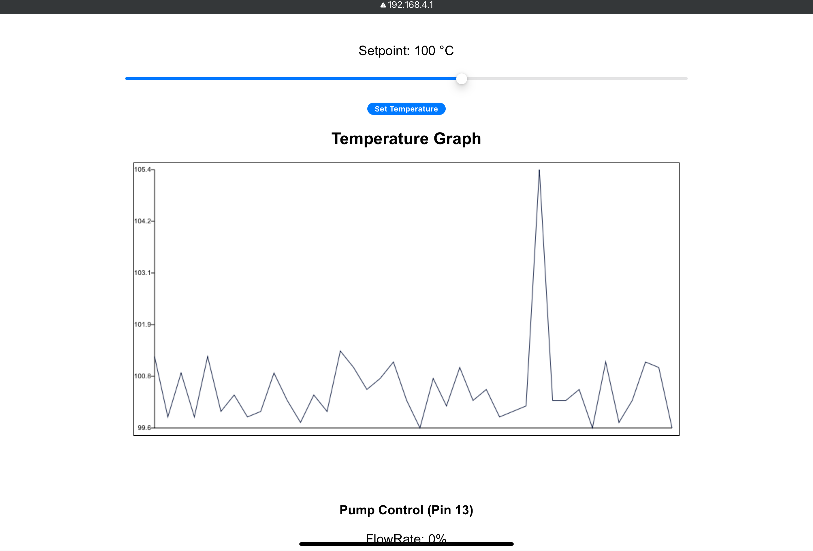
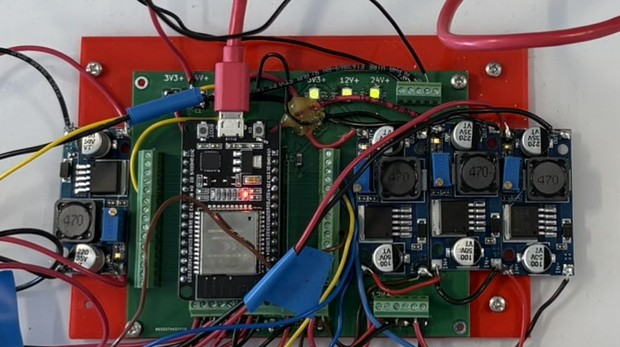

# Heater Control System

## Headspace Sampling Device

Automatic headspace sampling is a technique used to analyze the volatile organic compounds (VOCs) present in a liquid or solid phase sample. This method utilizes heat to separate lighter, volatile compounds from a heavier matrix. Designed as a low cost and efficient solution, this project aims to provide an automated headspace sampler for use in the mass spectrometry department. It employes a closed loop microcontroller system to precisely heat a sample vial to a specific temperature using a PID controller to maintain the temperature withing a 0.1° C error margin. Once the analyte reaches equilibrium in the gas phase, it is directed to a mass spectrometer via an arrangement piping an air pump and solenoid valve. A graphical user interface (GUI) integrates these components, providing cohesive control and monitoring of the process. 

### Headspace Sampler Operation

  

This video demonstrates the proper operation of the headspace sampling device.

---

### Vial Agitation

  

This video shows the correct technique for vial agitation during the sampling process.

---

### WebServer

 

Temperature Graph and Setpoint.

---

## Control Circuits

### Interposer Board for ESP32 Controller

  

**Features:**
- ESP32 microcontroller interface
- Signal conditioning
- I/O protection

---

### Heater Control PCB (KiCad Design)

  

**Specifications:**
- Input: 24V DC
- Input: 5V PWM
- Output: 24V PWM
- Max current: 5A

---

### PWM Control for Inductive Loads

  

**Specifications:**
- Input: 24V DC
- Input: 5V PWM
- Output: 12V PWM
- Max current: 5A

---

**File Structure**
- Fixture design files are found in 3D components folder.
- Firmware to upload to ESP32 as well as other relevant programs are found in the Code folder.
- Final Year Report, Poster and Videos are found in the Documents folder.
- Heater-Control-PCB folder conatins KiCad design files for the Heater Control PCB as well as gerber files for production.
- Interposer folder contains KiCad design files for the ESP32 interpose board and gerber files for production.
- PWM Control Folder contains KiCad design files for the PWM Controller boards for inductive loads.